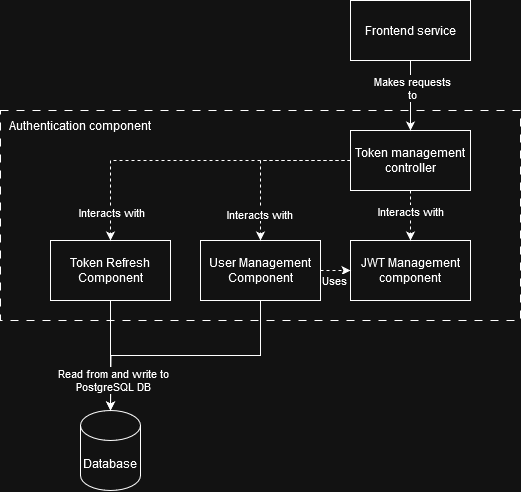
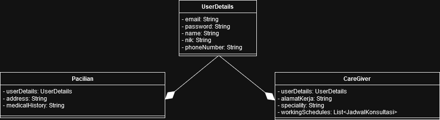

# Tugas Kelompok Pemrograman Lanjut

Tema: Panda Care

Kelompok: A14

Anggota:

1. Daffa Aqil Mahmud - 2306245056
2. Muhammad Satrio Haryo Kusumo - 2006597771
3. Thorbert Anson Shi - 2306221900
4. Agus Tini Sridewi - 2306276004
5. Freia Arianti Zulaika - 2306152254
6. Muhammad Faizi Ismady Supardjo - 2306244955

## Tutorial 9 Module B
The authentication module consists of the following high level components:
1. Token refresh component
2. User creation component
3. JWT management component

The token refresh component deals with renewing and reissuing refresh tokens to the end user, while the user creation component manages the data stored about the user. Finally, the JWT generation component securely and reliably generates and validates the issued and received JSON web tokens.

> The following diagram outlines the components of the authentication service.

> The following diagram is a simplified code diagram of the user management component.
